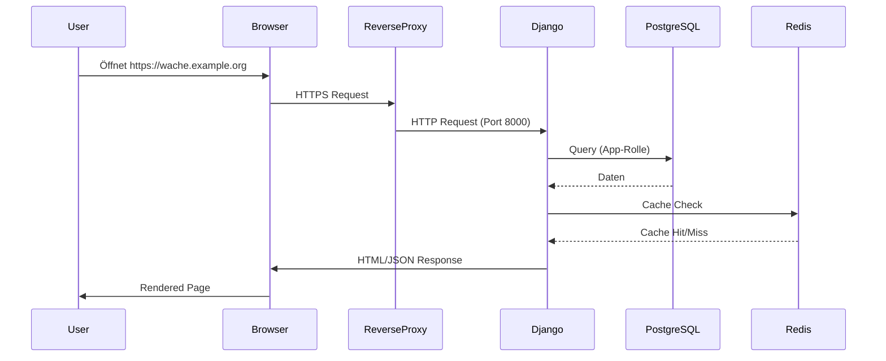
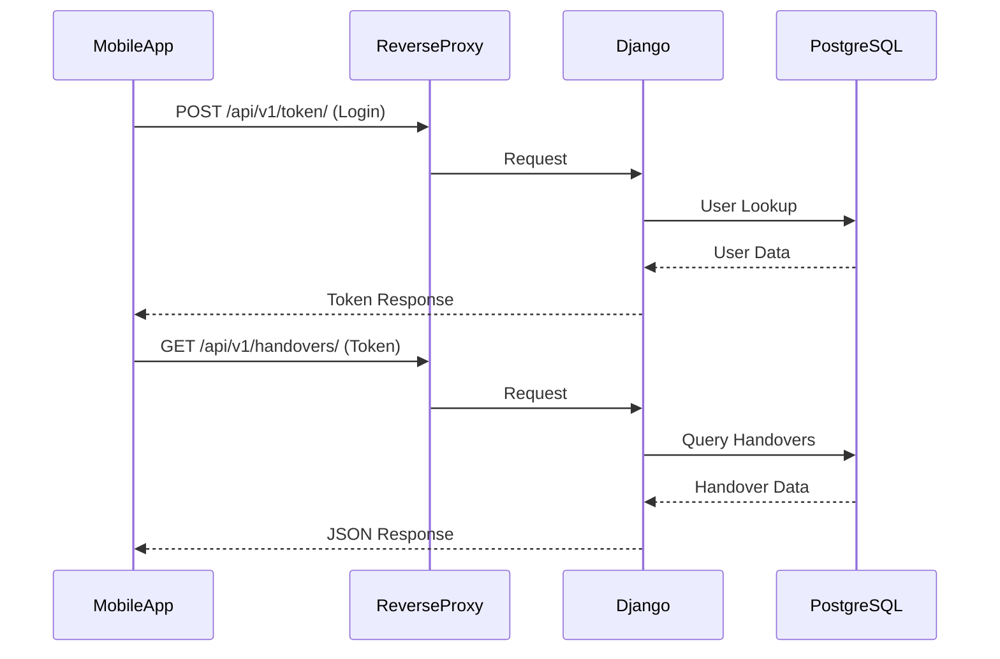
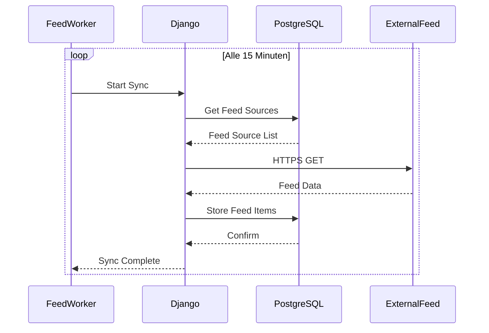
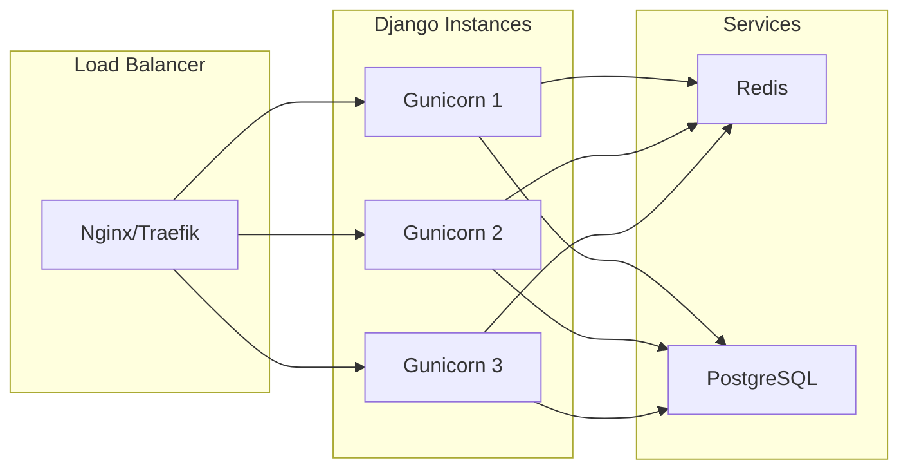

# Architektur – Rettungswache-Wachbuch

*Letzte Aktualisierung: August 2026 | Version: 0.15.0*

---

## 📋 **Inhaltsverzeichnis**

1. [Übersicht](#-übersicht)
2. [Systemarchitektur](#-systemarchitektur)
3. [Komponenten](#-komponenten)
4. [Datenfluss](#-datenfluss)
5. [Vertrauensgrenzen](#-vertrauensgrenzen)
6. [Sicherheitskonzept](#-sicherheitskonzept)
7. [Skalierbarkeit](#-skalierbarkeit)
8. [Technologie-Stack](#-technologie-stack)

---

## 🎯 **Übersicht**

Das **Rettungswache-Wachbuch** ist ein **modularer Monolith** basierend auf **Django** und **PostgreSQL**, der als **selbstgehostete Webanwendung** für die interne Organisation von Rettungswachen dient. Das System besteht aus mehreren **Docker-Containern**, die verschiedene Aufgaben übernehmen, aber eine **kohärente Anwendung** bilden.

### **Ziel des Systems**

- **Digitale Schichtübergaben** verwalten
- **Interne Kommunikation** ermöglichen
- **Organisatorische Aufgaben** unterstützen
- **Datenhoheit** bei der Rettungswache belassen
- **Datenschutz** durch Privacy-by-Design sicherstellen

### **Nicht-Ziele**

- ❌ Einsatzdaten verwalten
- ❌ Alarmierungen durchführen
- ❌ Dienstpläne erstellen
- ❌ Patientendokumentation unterstützen

---

## 🏗️ **Systemarchitektur**

```mermaid
graph TD
    subgraph Clients
        A[Mobile App\n(Flutter)]
        B[Web Browser\n(PWA)]
    end
    
    subgraph External
        C[Reverse Proxy\n(Nginx/Traefik)]
        D[Internet]
    end
    
    subgraph Docker Network
        E[Django/Gunicorn\n:8000]
        F[PostgreSQL\n:5432]
        G[Redis\n:6379]
        H[Feed Worker]
        I[Push Worker]
        J[Backup]
    end
    
    A -->|HTTPS| C
    B -->|HTTPS| C
    C -->|HTTP| E
    E -->|Internal| F
    E -->|Internal| G
    E -->|Internal| H
    E -->|Internal| I
    J -->|Internal| F
    
    style A fill:#03DAC6,stroke:#055
    style B fill:#03DAC6,stroke:#055
    style C fill:#3776ab,stroke:#1e3a8a
    style E fill:#092E20,stroke:#000
    style F fill:#336791,stroke:#000
    style G fill:#D82C20,stroke:#000
```

---

## 🧩 **Komponenten**

### **1. Web Application (Django)**

| Komponente | Verantwortung | Technologie |
|------------|---------------|-------------|
| **Views** | Business Logic, Request Handling | Django Views |
| **Models** | Datenstruktur, Business Rules | Django ORM |
| **Templates** | HTML-Rendering | Django Templates |
| **Static Files** | CSS, JS, Images | WhiteNoise |
| **API** | REST JSON API für Mobile Clients | Django REST Framework |

### **2. Datenbank (PostgreSQL)**

- **Version**: PostgreSQL 17.10
- **Rollen**: Getrennte Rollen für App, Feed, Backup
- **Schema**: Ein Schema (`public`) mit klaren Tabellen
- **Indexes**: Optimierte Indexes für häufige Abfragen
- **Constraints**: Datenintegrität durch DB-Constraints

#### **Datenbank-Rollen**

| Rolle | Rechte | Verwendung |
|-------|--------|------------|
| `rwsth_owner` | ALL PRIVILEGES | Schema-Migrationen, Backups |
| `rwsth_app` | SELECT, INSERT, UPDATE (eingeschränkt) | Django-Anwendung |
| `rwsth_feed` | SELECT, INSERT (nur Feed-Tabellen) | Feed-Worker |
| `rwsth_backup` | SELECT, pg_read_all_data | Backup-Container |

### **3. Cache (Redis)**

- **Version**: Redis 7.4
- **Verwendung**: 
  - View-Caching (Dashboard, Handovers, Calendar)
  - Session-Speicherung (optional)
  - Rate Limiting
- **Connection Pooling**: 100 Verbindungen
- **Timeouts**: Konfigurierbar pro View-Typ

### **4. Background Workers**

#### **Feed Worker**
- **Aufgabe**: Periodischer Abruf externer RSS/CSV-Quellen
- **Frequenz**: Konfigurierbar (standardmäßig alle 15 Minuten)
- **Sicherheit**: Allowlist für Hosts, keine Redirects

#### **Push Worker**
- **Aufgabe**: Web-Push-Benachrichtigungen senden
- **Mechanismus**: Transactional Outbox Pattern
- **Frequenz**: Polling alle 30 Sekunden

#### **Backup Container**
- **Aufgabe**: Tägliche PostgreSQL-Dumps
- **Speicherort**: Lokales `./backups/` Verzeichnis
- **Retention**: 7 Tage (konfigurierbar)
- **Sicherheit**: Optionale GPG-Verschlüsselung

---

## 🔄 **Datenfluss**

### **1. Web-Request-Flow**



### **2. Mobile API-Flow**



### **3. Feed Sync Flow**



---

## 🔒 **Vertrauensgrenzen**

### **1. Netzwerk-Grenzen**

```text
┌─────────────────────────────────────────────────────────────┐
│                        INTERNET (untrusted)                     │
└─────────────────────────────────────────────────────────────┘
                              │
                              ▼
┌─────────────────────────────────────────────────────────────┐
│                    REVERSE PROXY (trusted)                      │
│  - TLS Termination                                            │
│  - Static File Serving                                         │
│  - Request Forwarding                                          │
└─────────────────────────────────────────────────────────────┘
                              │
                              ▼
┌─────────────────────────────────────────────────────────────┐
│                    DOCKER NETWORK (trusted)                     │
│  ┌─────────────┐  ┌─────────────┐  ┌───────────────────────┐  │
│  │   Django    │  │  PostgreSQL │  │      Redis            │  │
│  │   (Web)     │◄─►│   (DB)      │  │      (Cache)          │  │
│  └─────────────┘  └─────────────┘  └───────────────────────┘  │
│  ┌─────────────┐  ┌─────────────┐  ┌───────────────────────┐  │
│  │ Feed Worker │  │ Push Worker │  │     Backup            │  │
│  └─────────────┘  └─────────────┘  └───────────────────────┘  │
└─────────────────────────────────────────────────────────────┘
```

### **2. Sicherheitsprinzipien**

| Prinzip | Umsetzung |
|---------|-----------|
| **Least Privilege** | Getrennte DB-Rollen, eingeschränkte Container-Rechte |
| **Defense in Depth** | Mehrere Sicherheitsebenen (Network, DB, App) |
| **Fail Secure** | Standardmäßig sichere Konfiguration |
| **Privacy by Design** | Keine sensiblen Daten, minimale Datenerfassung |
| **Transparency** | Offener Quellcode, klare Dokumentation |

### **3. Sicherheitsmaßnahmen**

#### **Netzwerk-Ebene**
- Docker bindet Web-Port **nur an Loopback (127.0.0.1)**
- **Keine exponierten Datenbank-Ports**
- **Interne Docker-Netzwerke** für Service-Kommunikation
- **Egress-Netzwerk** nur für Feed-Worker (mit Allowlist)

#### **Anwendungsebene**
- **TLS-Erzwingung** durch Reverse-Proxy
- **Sichere Cookies** (HttpOnly, Secure, SameSite=Lax)
- **CSRF-Schutz** für alle Formulare
- **CSP** (Content Security Policy) für XSS-Schutz
- **Rate Limiting** für Login und API-Endpunkte
- **Input Validation** auf allen Ebenen

#### **Datenebene**
- **Argon2id** für Passwort-Hashing
- **AES-256-GCM** für E2EE-Chat und TOTP at rest
- **Unveränderliche Daten** (Audit, Kaffeekasse, Übergaberevisionen)
- **DB-Constraints** für Datenintegrität

---

## 📈 **Skalierbarkeit**

### **1. Horizontale Skalierung**

Das System ist für **horizontale Skalierung** vorbereitet:



### **2. Skalierungsoptionen**

| Komponente | Skalierungsstrategie | Status |
|------------|---------------------|--------|
| **Web (Django)** | Mehrere Gunicorn-Worker + Load Balancer | ✅ Vorbereitet |
| **Datenbank** | PostgreSQL Read Replicas | ⚠️ Geplant |
| **Cache** | Redis Cluster | ⚠️ Geplant |
| **Workers** | Mehrere Celery-Worker | ⚠️ Geplant |
| **Storage** | Externer Object Storage (S3) | ❌ Nicht geplant |

### **3. Performance-Optimierungen**

| Optimierung | Umsetzung | Nutzen |
|-------------|-----------|--------|
| **Datenbank-Indexes** | Composite Indexes für häufige Queries | ⚡ Schnellere Abfragen |
| **Redis-Caching** | View-Caching für Dashboard, Handovers, etc. | ⚡ Reduzierte DB-Last |
| **Connection Pooling** | PostgreSQL & Redis | ⚡ Schnellere Verbindungen |
| **Static Files** | WhiteNoise CompressedManifestStorage | ⚡ Schnellere Asset-Auslieferung |
| **Lazy Loading** | Mobile App | ⚡ Schnellere App-Startzeit |

---

## 🛠️ **Technologie-Stack**

### **Backend**

| Komponente | Technologie | Version | Zweck |
|------------|-------------|---------|-------|
| **Framework** | Django | 6.0.7 | Web-Anwendung |
| **ORM** | Django ORM | 6.0.7 | Datenbankzugriff |
| **Datenbank** | PostgreSQL | 17.10 | Datenpersistenz |
| **Cache** | Redis | 7.4 | Caching |
| **Web Server** | Gunicorn | 26.0.0 | HTTP-Server |
| **Async** | Celery | (geplant) | Hintergrundaufgaben |
| **Container** | Docker | - | Bereitstellung |
| **Orchestrierung** | Docker Compose | v2 | Service-Management |

### **Frontend (Web)**

| Komponente | Technologie | Zweck |
|------------|-------------|-------|
| **Templates** | Django Templates | HTML-Rendering |
| **CSS** | Vanilla CSS | Styling |
| **JavaScript** | Vanilla JS | Interaktivität |
| **PWA** | Manifest + Service Worker | Installierbare App |

### **Frontend (Mobile)**

| Komponente | Technologie | Version | Zweck |
|------------|-------------|---------|-------|
| **Framework** | Flutter | SDK ^3.8.0 | Cross-Plattform UI |
| **Sprache** | Dart | ^3.8.0 | Programmiersprache |
| **State** | SetState + Provider | - | Zustandverwaltung |
| **Storage** | Shared Preferences | ^2.5.3 | Einstellungen |
| **Secure Storage** | Flutter Secure Storage | ^9.2.4 | Tokens, Keys |

---

## 📚 **Weiterführende Dokumentation**

| Dokument | Beschreibung |
|----------|--------------|
| [API v1](API.md) | REST-API-Spezifikation für Mobile Clients |
| [Client-Integration](CLIENT.md) | Anleitung für Mobile-Client-Entwicklung |
| [Sicherheit & Datenschutz](SECURITY-PRIVACY.md) | Sicherheitskonzept und Datenschutz |
| [Betrieb](OPERATIONS.md) | Backup, Updates, Monitoring |
| [Compliance](COMPLIANCE.md) | DSGVO, TDDDG, AI Act |
| [Go-Live-Checkliste](GO-LIVE-CHECKLIST.md) | Vorbereitung für Produktivbetrieb |

---

*Letzte Aktualisierung: August 2026 | Version: 0.15.0*