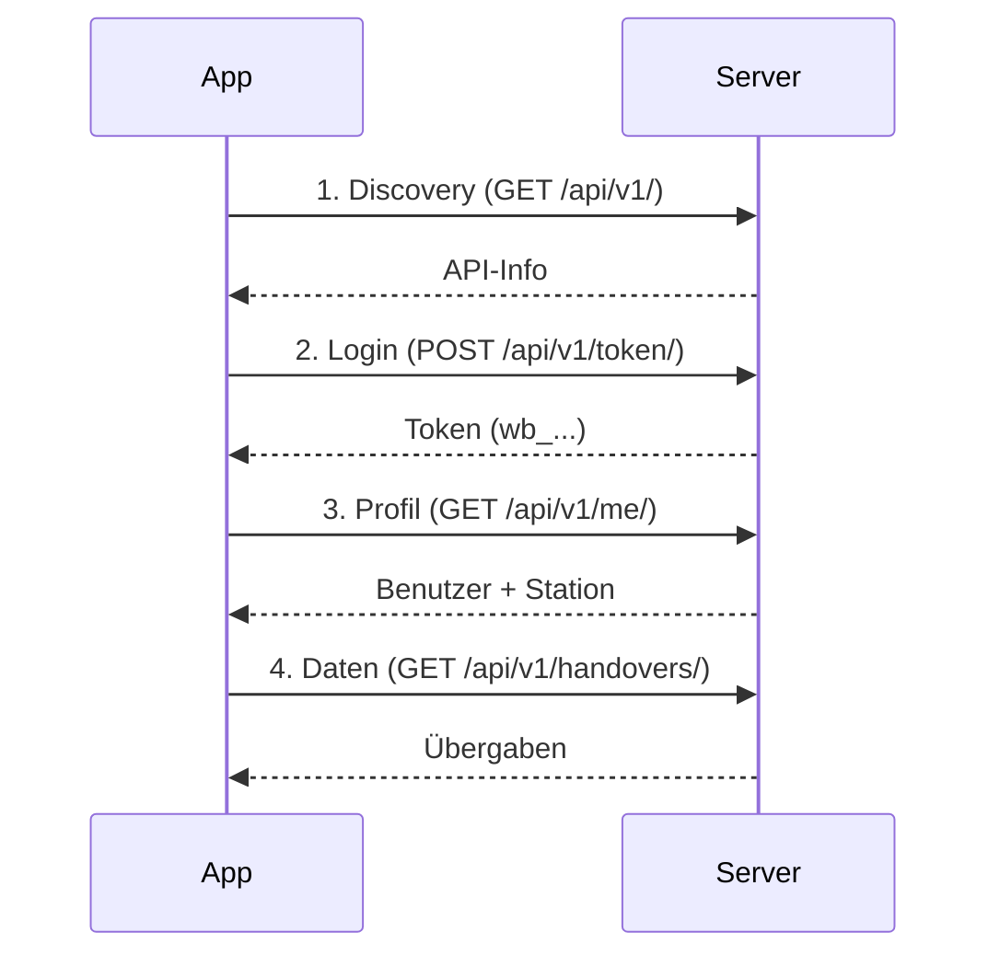

# Mobile Client Integration (iOS / Android)

*Letzte Aktualisierung: August 2026 | Client-Version: 0.5.1+ | Server-Version: 0.15.0+*

---

## 📱 **Übersicht**

Das **Rettungswache-Wachbuch** bietet eine **offizielle Mobile-App** für Android und iOS, die als **Open-Source-Begleit-Client** zum Server dient. Die App ermöglicht Mitarbeitern von Rettungswachen den **mobilen Zugriff** auf alle Funktionen des Wachbuchs – **ohne sensible Daten** (Einsätze, Patienten, Alarmierungen) zu verarbeiten.

---

## 🔗 **Repository-Struktur**

### **Zwei Repositories (aufeinander abgestimmt)**

| Repository | URL | Version | Zweck |
|------------|-----|---------|-------|
| **Server** | [Rettungswache-Wachbuch](https://github.com/darkspike1988/Rettungswache-Wachbuch) | ≥ 0.14.1 | Backend (Django/PostgreSQL) |
| **Client** | [Wachbuch-Client](https://github.com/darkspike1988/Wachbuch-Client) | 0.5.1+ | Mobile App (Flutter) |

### **Spiegel im Server-Repository**

- **Pfad**: `clients/wachbuch-mobile/`
- **Zweck**: Synchronisation für Docs/CI
- **Skripte**:
  - `./scripts/publish-mobile-client-repo.sh` → Server → Client
  - `./scripts/pull-mobile-client-repo.sh` → Client → Server

---

## 🔄 **Versionspaarung & Kompatibilität**

| Server-Version | Client-Version | API-Version | Neue Funktionen |
|----------------|----------------|-------------|-----------------|
| **0.15.0+** | **0.5.1+** | v1 | Demo-Modus, Kaffeekasse-Zahlungshinweise, App-Token-Härtung |
| **0.14.1+** | **0.5.0+** | v1 | API v1, App-Tokens, MFA-Unterstützung |
| **0.14.0+** | **0.5.0+** | v1 | Deutsche Alias-Pfade (`/uebergaben/`, `/kalender/`), Checklisten-Modul |
| **0.12.0+** | **0.2.x** | v1 | Mobile-Startflow (Server-Adresse oder QR-Code) |

> ⚠️ **Wichtig**: Die Client-Version muss **mindestens** die angegebene Version unterstützen. Ältere Clients funktionieren möglicherweise nicht mit neueren Servern.

---

## 🔌 **API-Kopplung**

### **Kommunikationsfluss**



### **Authentifizierungsflow**

1. **Server-Adresse eingeben** oder **QR-Code scannen**
   - `GET /api/v1/` → Discovery
   - QR-Code enthält: `wachbuch://connect?url=https://wache.example.org`

2. **Anmelden**
   - `POST /api/v1/token/` oder `POST /api/v1/anmeldung/` (Alias)
   - Body: `{"username": "...", "password": "...", "label": "Android App"}`
   - **Bei MFA**: Token muss im Web-UI unter `/konto/api/` erstellt werden

3. **Token speichern**
   - Token wird in **Flutter Secure Storage** gespeichert
   - Format: `wb_<zufällige_zeichen>` (Prefix + 32 Zeichen)
   - **Widerrufbar** im Web-UI oder durch Passwortänderung

4. **API-Anfragen**
   - Header: `Authorization: Token <wb_...>` oder `Authorization: Bearer <wb_...>`
   - **Kein CSRF** für Token-Auth (csrf_exempt)

---

## 📡 **API-Endpunkte (v1)**

### **Authentifizierung**

| Methode | Endpunkt | Beschreibung | Auth |
|---------|----------|--------------|------|
| `GET` | `/api/v1/` | API-Discovery | ❌ Nein |
| `GET` | `/api/v1/openapi.yaml` | OpenAPI-Spezifikation | ❌ Nein |
| `POST` | `/api/v1/token/` | Token gegen Benutzername/Passwort | ❌ Nein |
| `POST` | `/api/v1/anmeldung/` | Alias für `/token/` | ❌ Nein |

### **Benutzer & Station**

| Methode | Endpunkt | Beschreibung | Auth |
|---------|----------|--------------|------|
| `GET` | `/api/v1/me/` | Benutzerprofil, Rolle, Station | ✅ Token |
| `GET` | `/api/v1/status/` | Auth-/Mitgliedschaftsstatus | ⚠️ Optional |

### **Übergaben (Handovers)**

| Methode | Endpunkt | Beschreibung | Auth |
|---------|----------|--------------|------|
| `GET` | `/api/v1/handovers/` | Liste aktiver Übergaben | ✅ Token + Scope |
| `POST` | `/api/v1/handovers/` | Neue Übergabe erstellen | ✅ Token + Scope |
| `GET` | `/api/v1/handovers/<id>/` | Übergabe-Details | ✅ Token + Scope |
| `POST` | `/api/v1/handovers/<id>/status/` | Status ändern | ✅ Token + Scope |

**Deutsche Aliase:**
- `/api/v1/uebergaben/` ↔ `/api/v1/handovers/`
- `/api/v1/uebergaben/<id>/status/` ↔ `/api/v1/handovers/<id>/status/`

### **Kalender**

| Methode | Endpunkt | Beschreibung | Auth |
|---------|----------|--------------|------|
| `GET` | `/api/v1/kalender/` | Kalenderereignisse | ✅ Token + Scope |
| `POST` | `/api/v1/kalender/` | Neues Ereignis erstellen | ✅ Token + Scope |

**Deutsche Aliase:**
- `/api/v1/kalender/` ↔ `/api/v1/calendar/`

### **Kaffeekasse**

| Methode | Endpunkt | Beschreibung | Auth |
|---------|----------|--------------|------|
| `GET` | `/api/v1/kaffeekasse/` | Kassenbuchungen | ✅ Token + Scope |
| `POST` | `/api/v1/kaffeekasse/` | Neue Buchung erstellen | ✅ Token + Scope |

**Deutsche Aliase:**
- `/api/v1/kaffeekasse/` ↔ `/api/v1/coffee/`

### **Checklisten**

| Methode | Endpunkt | Beschreibung | Auth |
|---------|----------|--------------|------|
| `GET` | `/api/v1/checklisten/` | Checklisten | ✅ Token + Scope |
| `POST` | `/api/v1/checklisten/<id>/erledigt/` | Checkliste abschließen | ✅ Token + Scope |
| `POST` | `/api/v1/checklisten/<id>/abschluss/` | Alias für `/erledigt/` | ✅ Token + Scope |

**Deutsche Aliase:**
- `/api/v1/checklisten/` ↔ `/api/v1/checklists/`

---

## 🔐 **Scopes & Berechtigungen**

### **Standard-Scopes für App-Tokens**

Alle über `/konto/api/` oder `POST /api/v1/token/` erstellten Tokens erhalten folgende Scopes:

- `read:me` – Benutzerprofil lesen
- `read:handovers` – Übergaben lesen
- `write:handovers` – Übergaben erstellen/bearbeiten
- `read:calendar` – Kalender lesen
- `write:calendar` – Kalender bearbeiten
- `read:coffee` – Kaffeekasse lesen
- `write:coffee` – Kaffeekasse bearbeiten
- `read:checklists` – Checklisten lesen
- `write:checklists` – Checklisten bearbeiten

### **Rollenbasierte Einschränkungen**

Zusätzlich zu den Scopes gelten die **stationsbezogenen Rollen**:

| Rolle | Beschreibung | Berechtigungen |
|-------|--------------|----------------|
| `member` | Normales Mitglied | Lesen |
| `shift_lead` | Schichtleitung | Lesen + Status ändern |
| `cashier` | Kassenwart | Lesen + Kaffeekasse bearbeiten |
| `admin` | Master-Admin | Alle Module verwalten |
| `auditor` | Auditor | Nur Audit-Logs einsehen |

> ⚠️ **Wichtig**: Selbst mit allen Scopes kann ein Benutzer nur auf Daten seiner **eigenen Station** zugreifen.

---

## 📱 **App-Spezifische Funktionen**

### **Startflow**

1. **Splash Screen** (native Implementierung)
2. **Server-Adresse eingeben** oder **QR-Code scannen**
3. **Benutzername & Passwort** eingeben
4. **Anmelden** (Token wird gespeichert)
5. **Dashboard** wird angezeigt

### **Dashboard (Übersicht)**

- Aktive Übergaben (mit Priorität & Status)
- Nächste Kalenderereignisse
- Kassenstand (falls Modul aktiviert)
- Schnellzugriff auf Module

### **Navigation**

- **Smartphone**: Bottom Navigation Bar
- **Tablet**: Navigation Rail + Grid-Layout
- **Responsive**: Automatische Anpassung an Bildschirmgröße

### **Design**

- **Material Design 3** (MD3)
- **Farbschema**: Dunkelgrün (#1B5E20) als Primärfarbe
- **Theming**: Automatische Anpassung an System-Theming
- **Sonnenstand**: Tag/Nacht-Design basierend auf Standort

---

## 🔒 **Sicherheit**

### **Daten auf dem Gerät**

| Datentyp | Speicherort | Sicherheit |
|----------|------------|------------|
| **App-Tokens** | Flutter Secure Storage | Keychain (iOS) / Keystore (Android) |
| **Chat-Nachrichten** | Lokale Datenbank | AES-256-GCM + ECDH P-256 (E2EE) |
| **TOTP-Geheimnisse** | Flutter Secure Storage | Verschlüsselt |
| **Einstellungen** | Shared Preferences | Unverschlüsselt (nicht sensibel) |

### **Netzwerk-Sicherheit**

- **TLS 1.2+** für alle Verbindungen
- **Zertifikatsprüfung** (keine selbstsignierten Zertifikate)
- **Keine Daten an Dritte** (keine Telemetrie, Analytics, Tracking)
- **Token-Härtung**: Tokens sind widerrufbar und zeitlich begrenzt

### **Standortdaten**

- **Verwendung**: Nur für Sonnenaufgang/-untergang (Tag/Nacht-Design)
- **Speicherung**: Nur während der App-Nutzung im Speicher
- **Freigabe**: Nur bei aktiver App-Nutzung
- **Kein Tracking**: Standortdaten verlassen das Gerät nicht

---

## 🚀 **Entwicklung**

### **Client-Repository**

```bash
# Repository klonen
git clone https://github.com/darkspike1988/Wachbuch-Client.git
cd Wachbuch-Client

# Abhängigkeiten installieren
flutter pub get

# Code-Qualität prüfen
flutter analyze

# Tests ausführen
flutter test

# App starten (Entwicklung)
flutter run
```

### **Server-Integration testen**

1. **Server starten** (siehe [Server-README](https://github.com/darkspike1988/Rettungswache-Wachbuch#schnellstart-mit-docker))
2. **App starten** mit `flutter run`
3. **Server-Adresse eingeben**: `http://127.0.0.1:8090` (für lokale Tests)
4. **Anmelden** mit Testbenutzer

### **Demo-Modus**

Für lokale Tests kann der Server im **Demo-Modus** gestartet werden:

```bash
# In .env des Servers:
DEMO_MODE=true
MFA_ENABLED=false
DEFAULT_STATION_NAME=Demo-Wache Musterstadt
```

**Demo-Benutzer:**
- Benutzername: `demo-admin`
- Passwort: `Demo-Passwort-12345`

---

## 📦 **Build & Verteilung**

### **Android**

#### **Interne Testversion**

```bash
# APK für alle ABIs bauen
flutter build apk --release --flavor internal --split-per-abi

# Paket-ID: de.wachbuch.mobile.internal
# Kann parallel zur Produktions-App installiert werden
```

#### **Produktionsversion**

```bash
# AppBundle für Google Play
flutter build appbundle --release --flavor production

# APKs für direkte Installation
flutter build apk --release --flavor production --split-per-abi

# Paket-ID: de.wachbuch.mobile
```

### **iOS**

#### **Simulator-Build**

```bash
flutter build ios --simulator --debug
```

#### **Release-Build**

```bash
flutter build ios --release --no-codesign
```

#### **TestFlight**

Siehe [docs/IOS-TESTFLIGHT.md](https://github.com/darkspike1988/Wachbuch-Client/blob/main/docs/IOS-TESTFLIGHT.md) für die vollständige Anleitung.

---

## 📚 **Weiterführende Dokumentation**

| Dokument | Beschreibung | Repository |
|----------|--------------|------------|
| [Client README](https://github.com/darkspike1988/Wachbuch-Client#readme) | Hauptdokumentation | Wachbuch-Client |
| [Android Install](https://github.com/darkspike1988/Wachbuch-Client/blob/main/docs/INSTALL-ANDROID.md) | Android-Installation | Wachbuch-Client |
| [Play Store](https://github.com/darkspike1988/Wachbuch-Client/blob/main/docs/PLAY-STORE.md) | Google Play Veröffentlichung | Wachbuch-Client |
| [TestFlight](https://github.com/darkspike1988/Wachbuch-Client/blob/main/docs/IOS-TESTFLIGHT.md) | iOS TestFlight | Wachbuch-Client |
| [API v1](API.md) | Server-API-Spezifikation | Rettungswache-Wachbuch |
| [Betrieb](OPERATIONS.md) | Server-Betrieb | Rettungswache-Wachbuch |

---

## 🤝 **Support & Community**

- **Client-Issues**: [Wachbuch-Client Issues](https://github.com/darkspike1988/Wachbuch-Client/issues)
- **Server-Issues**: [Rettungswache-Wachbuch Issues](https://github.com/darkspike1988/Rettungswache-Wachbuch/issues)
- **Discussions**: [GitHub Discussions](https://github.com/darkspike1988/Rettungswache-Wachbuch/discussions)

---

*Letzte Aktualisierung: August 2026 | Client: 0.5.1+ | Server: 0.15.0+*