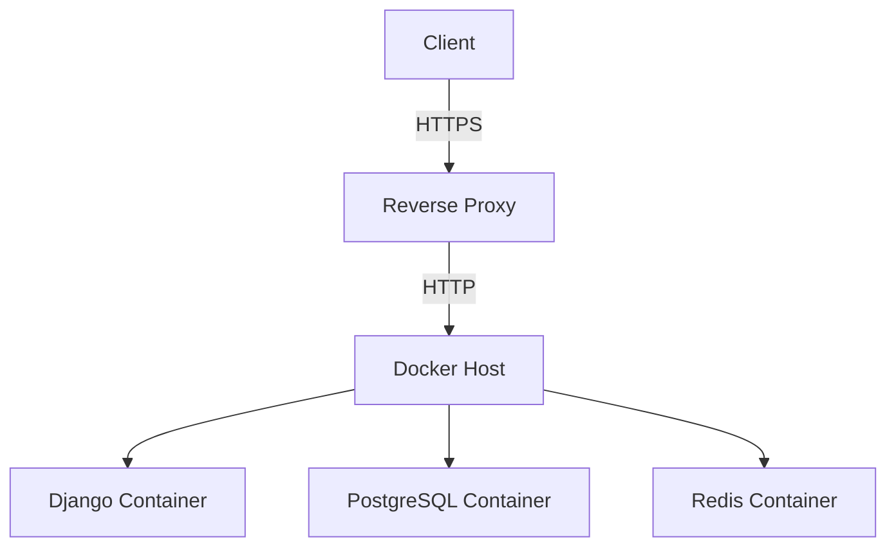
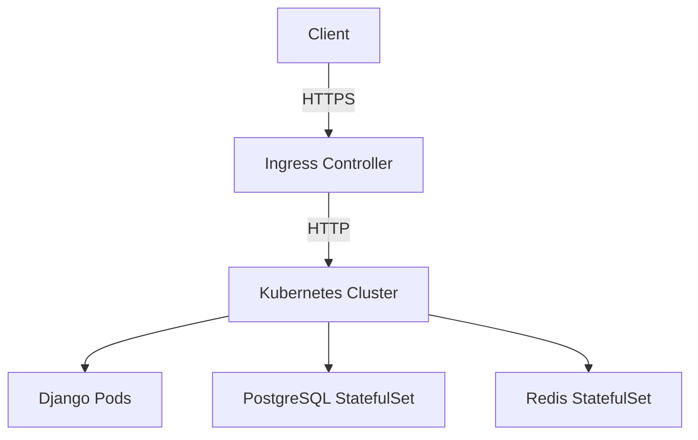
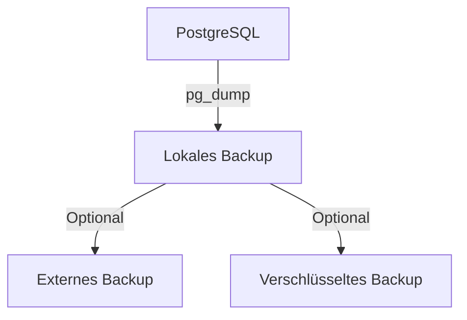

# Betriebshandbuch – Rettungswache-Wachbuch

*Letzte Aktualisierung: August 2026 | Version: 0.15.0*

---

## 📋 **Inhaltsverzeichnis**

1. [Einführung](#-einführung)
2. [Bereitstellung](#-bereitstellung)
3. [Konfiguration](#-konfiguration)
4. [Backup & Wiederherstellung](#-backup--wiederherstellung)
5. [Monitoring & Logging](#-monitoring--logging)
6. [Updates & Wartung](#-updates--wartung)
7. [Sicherheit](#-sicherheit)
8. [Fehlerbehebung](#-fehlerbehebung)
9. [Checklisten](#-checklisten)

---

## 🎯 **Einführung**

Dieses Dokument beschreibt den **Betrieb** des Rettungswache-Wachbuchs in **Produktionsumgebungen**. Es richtet sich an **Systemadministratoren** und **Betreiber**, die das System installieren, konfigurieren und warten.

### **Zielgruppe**

- Systemadministratoren
- DevOps-Engineers
- IT-Verantwortliche in Rettungswachen
- Hosting-Provider

### **Voraussetzungen**

- Grundkenntnisse in **Docker** und **Docker Compose**
- Erfahrung mit **Linux-Servern**
- Verständnis von **Netzwerkkonfiguration**
- Kenntnisse in **TLS/SSL-Zertifikaten**

---

## 🚀 **Bereitstellung**

### **1. Systemanforderungen**

| Ressource | Minimum | Empfohlen | Produktion |
|-----------|---------|-----------|------------|
| **CPU** | 1 Kern | 2 Kerne | 4+ Kerne |
| **RAM** | 512 MB | 1 GB | 2+ GB |
| **Festplatte** | 1 GB | 5 GB | 10+ GB |
| **Datenbank** | - | - | PostgreSQL 17 |
| **Betriebssystem** | Linux | Linux | Linux |
| **Docker** | 20.10+ | 24.0+ | 24.0+ |
| **Docker Compose** | v2 | v2 | v2 |

### **2. Bereitstellungsoptionen**

#### **Option A: Docker Compose (empfohlen für kleine bis mittlere Installationen)**



**Vorteile:**
- Einfache Einrichtung
- Gute Performance für bis zu 100 Benutzer
- Einfache Wartung

**Nachteile:**
- Keine automatische Skalierung
- Single Point of Failure

#### **Option B: Kubernetes (für große Installationen)**



**Vorteile:**
- Automatische Skalierung
- Hohe Verfügbarkeit
- Einfache Updates

**Nachteile:**
- Komplexere Einrichtung
- Höhere Betriebskosten

#### **Option C: Managed Services (für maximale Einfachheit)**

- **Datenbank**: Managed PostgreSQL (z.B. AWS RDS, Google Cloud SQL)
- **Cache**: Managed Redis (z.B. AWS ElastiCache, Google Memorystore)
- **Container**: Managed Kubernetes (z.B. EKS, GKE, AKS)

**Vorteile:**
- Keine eigene Infrastruktur
- Automatische Backups
- Hohe Verfügbarkeit

**Nachteile:**
- Höhere Kosten
- Abhängigkeit von Cloud-Anbieter

---

## ⚙️ **Konfiguration**

### **1. Umgebungsvariablen (.env)**

Die Hauptkonfiguration erfolgt über die **`.env`**-Datei. **NIEMALS** diese Datei in Version Control commiten!

#### **Beispiel .env-Datei**

```bash
# =============================================================================
# SECRETS - JEDES FELD MIT EINEM ZUFÄLLIGEN WERT FÜLLEN!
# Generieren mit: openssl rand -hex 32
# =============================================================================

# Django Secret Key (REQUIRED)
DJANGO_SECRET_KEY=dein_zufaelliger_schluessel_hier_32_zeichen

# Datenbank Passwörter (REQUIRED)
POSTGRES_PASSWORD=dein_postgres_password
APP_DB_PASSWORD=dein_app_db_password
FEED_DB_PASSWORD=dein_feed_db_password
BACKUP_DB_PASSWORD=dein_backup_db_password

# Feed Worker Secret Key (optional, falls Feed Worker aktiv)
FEED_WORKER_SECRET_KEY=dein_feed_worker_schluessel

# Push Worker Secret Key (optional, falls Web Push aktiv)
PUSH_WORKER_SECRET_KEY=dein_push_worker_schluessel

# =============================================================================
# DATENBANK
# =============================================================================

POSTGRES_DB=rwsth
POSTGRES_USER=rwsth_owner
APP_DB_USER=rwsth_app
FEED_DB_USER=rwsth_feed
BACKUP_DB_USER=rwsth_backup

# =============================================================================
# DJANGO
# =============================================================================

DJANGO_DEBUG=false
SECURE_COOKIES=true
ALLOWED_HOSTS=wache.example.org,localhost,127.0.0.1
CSRF_TRUSTED_ORIGINS=https://wache.example.org

# =============================================================================
# STATION
# =============================================================================

DEFAULT_STATION_NAME=Rettungswache Musterstadt
DEFAULT_STATION_SLUG=rettungswache-musterstadt

# =============================================================================
# SICHERHEIT
# =============================================================================

MFA_ENABLED=true
MFA_REQUIRED=false
DEMO_MODE=false
DEMO_PASSWORD=Demo-Passwort-12345

# =============================================================================
# EXTERNE QUELLEN
# =============================================================================

FEED_ALLOWED_HOSTS=verkehr.example.org,warnungen.example.org

# =============================================================================
# REGISTRIERUNG
# =============================================================================

REGISTRATION_ENABLED=false
REGISTRATION_RATE_LIMIT=5

# =============================================================================
# WEB PUSH (optional)
# =============================================================================

WEB_PUSH_ENABLED=false
VAPID_PUBLIC_KEY=
VAPID_PRIVATE_KEY=
VAPID_ADMIN_EMAIL=ops@wache.example.org

# =============================================================================
# BACKUP
# =============================================================================

BACKUP_RETENTION_DAYS=7
BACKUP_ENCRYPT_REMOTE=false
BACKUP_GPG_RECIPIENT=
BACKUP_OFF_TARGET=

# =============================================================================
# REDIS (optional, für Caching)
# =============================================================================

REDIS_HOST=redis
REDIS_PORT=6379
REDIS_DB=0
REDIS_PASSWORD=

# =============================================================================
# NETZWERK
# =============================================================================

HTTP_BIND_ADDRESS=127.0.0.1
HTTP_PORT=8090
```

### **2. Wichtige Konfigurationsoptionen**

#### **Sicherheit**

| Variable | Standard | Empfehlung | Beschreibung |
|----------|----------|------------|--------------|
| `DJANGO_DEBUG` | `false` | `false` | Debug-Modus deaktivieren |
| `SECURE_COOKIES` | `true` | `true` | Sichere Cookies erzwingen |
| `ALLOWED_HOSTS` | - | `wache.example.org` | Erlaubte Hostnames |
| `CSRF_TRUSTED_ORIGINS` | - | `https://wache.example.org` | Vertrauenswürdige Ursprünge |
| `MFA_ENABLED` | `true` | `true` | MFA aktivieren |
| `MFA_REQUIRED` | `false` | `true` | MFA erzwingen |

#### **Datenbank**

| Variable | Standard | Empfehlung | Beschreibung |
|----------|----------|------------|--------------|
| `POSTGRES_DB` | `rwsth` | `rwsth` | Datenbankname |
| `POSTGRES_USER` | `rwsth_owner` | `rwsth_owner` | Datenbank-Besitzer |
| `APP_DB_USER` | `rwsth_app` | `rwsth_app` | Anwendungs-Benutzer |

#### **Backup**

| Variable | Standard | Empfehlung | Beschreibung |
|----------|----------|------------|--------------|
| `BACKUP_RETENTION_DAYS` | `7` | `30` | Aufbewahrungsdauer |
| `BACKUP_ENCRYPT_REMOTE` | `false` | `true` | Backups verschlüsseln |
| `BACKUP_OFF_TARGET` | - | `s3://backups/` | Externes Backup-Ziel |

#### **Performance**

| Variable | Standard | Empfehlung | Beschreibung |
|----------|----------|------------|--------------|
| `REDIS_HOST` | `redis` | `redis` | Redis-Host |
| `REDIS_PORT` | `6379` | `6379` | Redis-Port |

---

## 💾 **Backup & Wiederherstellung**

### **1. Backup-Strategie**

Das System implementiert eine **mehrschichtige Backup-Strategie**:



### **2. Lokale Backups (Standard)**

- **Frequenz**: Täglich um 02:00 Uhr
- **Speicherort**: `./backups/`
- **Format**: PostgreSQL Custom Format (`.dump`)
- **Retention**: 7 Tage (konfigurierbar)
- **Kompression**: Gzip

#### **Backup manuell auslösen**

```bash
# Backup erstellen
docker compose exec -T db pg_dump -Fc -U rwsth_owner -d rwsth -f /backups/manual_$(date +%Y%m%d_%H%M%S).dump

# Backup-Verzeichnis auflisten
docker compose exec db ls -lh /backups/
```

### **3. Externe Backups (empfohlen für Produktion)**

#### **Option A: S3-kompatibler Speicher**

```bash
# .env konfigurieren
BACKUP_OFF_TARGET=s3://mein-bucket/backups/
BACKUP_ENCRYPT_REMOTE=true

# AWS Credentials in Docker Compose hinzufügen
# (oder IAM-Rollen für EC2-Instanzen verwenden)
```

#### **Option B: SFTP/SCP**

```bash
# Backup-Skript anpassen, um per SCP zu kopieren
# Beispiel in scripts/backup-loop.sh
```

#### **Option C: Rclone**

```bash
# Rclone konfigurieren
rclone config

# Backup per Rclone kopieren
rclone copy ./backups/ remote:backups/
```

### **4. Verschlüsselte Backups**

```bash
# GPG-Verschlüsselung aktivieren
BACKUP_ENCRYPT_REMOTE=true
BACKUP_GPG_RECIPIENT=deine@email.com

# Manuell verschlüsseln
gpg --batch --yes --cipher-algo AES256 \
    --passphrase "dein_passphrase" \
    --output backup.dump.gpg \
    --symmetric backup.dump
```

### **5. Backup-Wiederherstellung**

#### **Schritt-für-Schritt**

1. **Container stoppen**:
   ```bash
   docker compose down
   ```

2. **Datenbank zurücksetzen**:
   ```bash
   docker compose exec -T db dropdb -U rwsth_owner rwsth
   docker compose exec -T db createdb -U rwsth_owner rwsth
   ```

3. **Backup wiederherstellen**:
   ```bash
   # Für unverschlüsselte Backups
   docker compose exec -T db pg_restore -U rwsth_owner -d rwsth -C /backups/backup.dump
   
   # Für verschlüsselte Backups
   gpg --decrypt /backups/backup.dump.gpg | \
     docker compose exec -T db pg_restore -U rwsth_owner -d rwsth -C -
   ```

4. **Migrationen ausführen**:
   ```bash
   docker compose up --build -d migrate
   ```

5. **Container neu starten**:
   ```bash
   docker compose up -d
   ```

#### **Backup-Test**

```bash
# Test-Restore in isolierter Datenbank
docker compose exec -T backup /bin/sh /backup/restore-test.sh
```

---

## 📊 **Monitoring & Logging**

### **1. Container-Logs**

```bash
# Alle Logs anzeigen
docker compose logs -f

# Logs eines bestimmten Services
docker compose logs -f web

# Logs mit Zeitstempeln
docker compose logs -f --timestamps web

# Logs der letzten 100 Zeilen
docker compose logs --tail 100 web
```

### **2. Health Checks**

Das System implementiert **Health Checks** für alle Services:

| Service | Health Check Endpunkt | Beschreibung |
|---------|----------------------|--------------|
| Web | `GET /healthz/` | Django-Anwendung |
| DB | `pg_isready` | PostgreSQL |
| Redis | `PING` | Redis |

#### **Health Check testen**

```bash
# Web-Service
curl http://127.0.0.1:8090/healthz/

# Datenbank
curl http://127.0.0.1:8090/healthz/  # Enthält DB-Status

# Alle Services
watch -n 5 "docker compose ps && docker compose exec -T db pg_isready"
```

### **3. Metriken (geplant)**

Für Produktionsumgebungen wird **Prometheus + Grafana** empfohlen:

```yaml
# docker-compose.override.yml
services:
  prometheus:
    image: prom/prometheus
    ports:
      - "9090:9090"
    volumes:
      - ./monitoring/prometheus.yml:/etc/prometheus/prometheus.yml

  grafana:
    image: grafana/grafana
    ports:
      - "3000:3000"
    volumes:
      - grafana-storage:/var/lib/grafana
```

### **4. Alerting (geplant)**

- **Prometheus Alertmanager** für Benachrichtigungen
- **Slack/Email-Integration** für kritische Fehler
- **Uptime Monitoring** (z.B. UptimeRobot, Healthchecks.io)

---

## 🔄 **Updates & Wartung**

### **1. System-Updates**

#### **Docker-Images aktualisieren**

```bash
# Images neu bauen und Container neu starten
docker compose pull
docker compose up --build -d
```

#### **Abhängigkeiten aktualisieren**

```bash
# Python-Abhängigkeiten
pip-compile --upgrade requirements.txt

# Flutter-Abhängigkeiten
cd clients/wachbuch-mobile
flutter pub upgrade
```

### **2. Datenbank-Migrationen**

```bash
# Migrationen ausführen
docker compose exec web python manage.py migrate

# Migrationen prüfen
docker compose exec web python manage.py makemigrations --check --dry-run

# Migrationen erstellen
docker compose exec web python manage.py makemigrations
```

### **3. Cache leeren**

```bash
# Redis-Cache leeren
docker compose exec redis redis-cli FLUSHALL

# Django-Cache leeren
docker compose exec web python manage.py clear_cache
```

### **4. Rate Limit Cache bereinigen**

```bash
# Ältere Rate Limit Einträge löschen
docker compose exec web python manage.py cleanup_ratelimits
```

---

## 🔒 **Sicherheit**

### **1. TLS-Konfiguration**

#### **Option A: Nginx als Reverse Proxy**

```nginx
# /etc/nginx/sites-available/wachbuch

upstream django {
    server 127.0.0.1:8090;
}

server {
    listen 80;
    server_name wache.example.org;
    return 301 https://$host$request_uri;
}

server {
    listen 443 ssl http2;
    server_name wache.example.org;

    ssl_certificate /etc/letsencrypt/live/wache.example.org/fullchain.pem;
    ssl_certificate_key /etc/letsencrypt/live/wache.example.org/privkey.pem;
    ssl_session_timeout 1d;
    ssl_session_cache shared:SSL:50m;
    ssl_protocols TLSv1.2 TLSv1.3;
    ssl_ciphers ECDHE-ECDSA-AES128-GCM-SHA256:ECDHE-RSA-AES128-GCM-SHA256;
    ssl_prefer_server_ciphers off;
    ssl_stapling on;
    ssl_stapling_verify on;

    # Security Headers
    add_header X-Content-Type-Options "nosniff" always;
    add_header X-Frame-Options "DENY" always;
    add_header X-XSS-Protection "1; mode=block" always;
    add_header Referrer-Policy "strict-origin-when-cross-origin" always;

    location / {
        proxy_pass http://django;
        proxy_set_header Host $host;
        proxy_set_header X-Real-IP $remote_addr;
        proxy_set_header X-Forwarded-For $proxy_add_x_forwarded_for;
        proxy_set_header X-Forwarded-Proto $scheme;
    }

    location /static/ {
        alias /path/to/staticfiles/;
    }
}
```

#### **Option B: Traefik als Reverse Proxy**

```yaml
# docker-compose.override.yml
services:
  traefik:
    image: traefik:v2.10
    command:
      - --providers.docker=true
      - --entrypoints.web.address=:80
      - --entrypoints.websecure.address=:443
      - --certificatesresolvers.letsencrypt.acme.email=admin@wache.example.org
      - --certificatesresolvers.letsencrypt.acme.storage=/letsencrypt/acme.json
      - --certificatesresolvers.letsencrypt.acme.httpchallenge.entrypoint=web
    ports:
      - "80:80"
      - "443:443"
    volumes:
      - /var/run/docker.sock:/var/run/docker.sock
      - ./letsencrypt:/letsencrypt
    labels:
      - "traefik.enable=true"
      - "traefik.http.routers.traefik.rule=Host(`traefik.wache.example.org`)"
      - "traefik.http.routers.traefik.service=api@internal"
      - "traefik.http.routers.traefik.entrypoints=websecure"
      - "traefik.http.routers.traefik.tls.certresolver=letsencrypt"

  web:
    labels:
      - "traefik.enable=true"
      - "traefik.http.routers.web.rule=Host(`wache.example.org`)"
      - "traefik.http.routers.web.entrypoints=websecure"
      - "traefik.http.routers.web.tls.certresolver=letsencrypt"
      - "traefik.http.services.web.loadbalancer.server.port=8000"
```

### **2. Firewall-Konfiguration**

```bash
# UFW (Ubuntu)
ufw allow 80/tcp
ufw allow 443/tcp
ufw allow 22/tcp  # SSH
ufw enable

# Nur bestimmte IPs erlauben (optional)
ufw allow from 192.168.1.0/24 to any port 80,443
ufw deny 80/tcp
ufw deny 443/tcp
```

### **3. Fail2Ban für SSH**

```bash
# Fail2Ban installieren
sudo apt install fail2ban

# Fail2Ban für SSH konfigurieren
sudo systemctl enable fail2ban
sudo systemctl start fail2ban
```

### **4. Automatische Sicherheitsupdates**

```bash
# Unattended Upgrades (Debian/Ubuntu)
sudo apt install unattended-upgrades
sudo dpkg-reconfigure unattended-upgrades

# Nur Sicherheitsupdates
sudo sed -i 's|//"${distro_id}:${distro_codename}-security"|"${distro_id}:${distro_codename}-security"|' /etc/apt/sources.list
```

---

## 🐛 **Fehlerbehebung**

### **1. Häufige Probleme**

#### **Problem: Container startet nicht**

```bash
# Logs prüfen
docker compose logs web

# Container-Status prüfen
docker compose ps

# Ressourcen prüfen
docker stats
```

**Lösungen:**
- **Port bereits belegt**: `docker compose down` und neu starten
- **Fehlende Umgebungsvariablen**: `.env` prüfen
- **Datenbank nicht bereit**: `docker compose logs db`

#### **Problem: Datenbank-Verbindung fehlgeschlagen**

```bash
# Datenbank-Status prüfen
docker compose exec db pg_isready -U rwsth_owner -d rwsth

# Datenbank-Logs prüfen
docker compose logs db

# Datenbank manuell starten
docker compose up -d db
```

**Lösungen:**
- **Falsche Credentials**: `.env` prüfen
- **Datenbank nicht initialisiert**: `docker compose up -d migrate`
- **Port-Konflikt**: Andere PostgreSQL-Instanz stoppen

#### **Problem: Migrationen fehlgeschlagen**

```bash
# Migrationen manuell ausführen
docker compose exec web python manage.py migrate

# Migrationen prüfen
docker compose exec web python manage.py showmigrations

# Migrationen zurücksetzen
docker compose exec web python manage.py migrate zero
```

**Lösungen:**
- **Datenbank-Backup wiederherstellen**
- **Migrationen manuell anpassen**
- **Django-Version prüfen**

#### **Problem: Static Files werden nicht geladen**

```bash
# Static Files sammeln
docker compose exec web python manage.py collectstatic

# Static Files prüfen
ls -la staticfiles/

# Berechtigungen prüfen
ls -la staticfiles/ | head -20
```

**Lösungen:**
- **Berechtigungen setzen**: `chmod -R 755 staticfiles/`
- **Volume-Mount prüfen**: `docker-compose.yml`
- **WhiteNoise prüfen**: `STORAGES` in `settings.py`

### **2. Debug-Modus aktivieren**

```bash
# .env anpassen
DJANGO_DEBUG=true
SECURE_COOKIES=false

# Container neu starten
docker compose up -d web

# Logs prüfen
docker compose logs -f web
```

⚠️ **Warnung**: Debug-Modus **nie** in Produktion verwenden!

---

## ✅ **Checklisten**

### **📋 Vor dem Go-Live**

- [ ] **Sicherheit**
  - [ ] TLS-Zertifikat installiert
  - [ ] `.env` mit sicheren Werten gefüllt
  - [ ] Debug-Modus deaktiviert
  - [ ] Sichere Cookies aktiviert
  - [ ] Firewall konfiguriert
  - [ ] Backups getestet

- [ ] **Konfiguration**
  - [ ] `ALLOWED_HOSTS` gesetzt
  - [ ] `CSRF_TRUSTED_ORIGINS` gesetzt
  - [ ] Datenbank-Credentials korrekt
  - [ ] Redis konfiguriert (optional)

- [ ] **Testing**
  - [ ] Health Check funktioniert
  - [ ] Login funktioniert
  - [ ] Alle Module getestet
  - [ ] Mobile App getestet

- [ ] **Dokumentation**
  - [ ] Betriebshandbuch gelesen
  - [ ] Notfallkontakte hinterlegt
  - [ ] Monitoring eingerichtet

### **📋 Regelmäßige Wartung**

- [ ] **Täglich**
  - [ ] Backups prüfen
  - [ ] Logs auf Fehler prüfen
  - [ ] Health Checks prüfen

- [ ] **Wöchentlich**
  - [ ] System-Updates prüfen
  - [ ] Datenbank-Backup testen
  - [ ] Performance prüfen

- [ ] **Monatlich**
  - [ ] Sicherheitsupdates prüfen
  - [ ] Abhängigkeiten aktualisieren
  - [ ] Notfall-Wiederherstellung testen

- [ ] **Jährlich**
  - [ ] TLS-Zertifikat erneuern
  - [ ] Passwörter rotieren
  - [ ] Architektur-Review

---

## 📚 **Weiterführende Dokumentation**

- [Architektur](ARCHITECTURE.md) – Technische Architektur
- [Sicherheit & Datenschutz](SECURITY-PRIVACY.md) – Sicherheitskonzept
- [API v1](API.md) – REST-API-Dokumentation
- [Go-Live-Checkliste](GO-LIVE-CHECKLIST.md) – Vorbereitung für Produktion
- [Compliance](COMPLIANCE.md) – Rechtliche Anforderungen

---

*Letzte Aktualisierung: August 2026 | Version: 0.15.0*